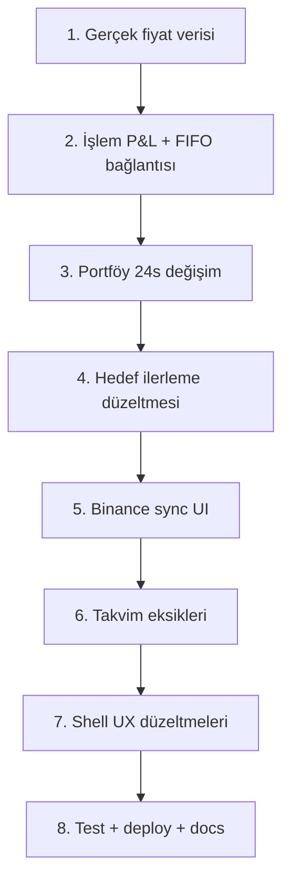

# Crypto Dashboard — Mevcut Durum ve MVP Eksikleri

> Son güncelleme: 2026-06-12  
> Kapsam: `app/` Next.js uygulaması, `context/PRD.md` kabul kriterleri ve kod incelemesi

---

## Özet

Proje, tek bir **Next.js 16** uygulaması (`app/`) etrafında kurulu. Ürün dokümantasyonu (`context/`, `docs/`), tasarım prototipi (`design_handoff_crypto_dashboard/`) ve çalışan kod yan yana duruyor. Çekirdek özelliklerin büyük kısmı kodlanmış; ancak bir kısmı **stub/sentetik veri** kullanıyor veya PRD kabul kriterlerini karşılamıyor.

**Genel tamamlanma tahmini:** MVP iskeletinin ~%70–75'i tamamlanmış.

---

## Mevcut Durum Özeti

| Alan | Durum |
|------|-------|
| **Mimari** | Next.js App Router + API Routes + Prisma (SQLite) — ayrı backend yok |
| **Sayfalar** | 8 korumalı sayfa + login |
| **Auth** | JWT + bcrypt + httpOnly cookie + middleware koruması |
| **Veri katmanı** | 7 Prisma modeli, 22 API route |
| **Fiyat verisi** | Binance REST (birincil) + CoinGecko fallback, 15 sn polling |
| **State** | Zustand store + fetch tabanlı API client |
| **UI** | shadcn/ui, dark/light tema, responsive shell |
| **Test / CI / Deploy** | Yok |

### Proje yapısı

```text
crypto-dashboard/
├── README.md                          # Ürün kapsamı + stack (kısmen güncel değil)
├── docs/
│   ├── backend-plan.md                # API/DB/auth mimari planı
│   └── mvp-durum-raporu.md            # Bu dosya
├── context/                           # PRD + modül spesifikasyonları
├── design_handoff_crypto_dashboard/   # React prototip (MOCK veri)
└── app/                               # Asıl Next.js uygulaması
    ├── prisma/schema.prisma
    └── src/
        ├── app/(authed)/              # 8 korumalı sayfa
        ├── app/api/                   # 22 route handler
        ├── components/                # shadcn/ui + crypto + shell
        └── lib/                       # auth, prisma, api, fifo, prices
```

### Çalışan modüller

| Modül | Route | Backend | UI | Not |
|-------|-------|---------|-----|-----|
| Giriş / Kayıt | `/login` | ✅ | ✅ | Gerçek auth (kök README güncel değil) |
| Ana Sayfa | `/dashboard` | ✅ | ⚠️ | Özet var; sparkline sahte |
| Varlık Listesi | `/watchlist` | ✅ | ⚠️ | CRUD kısmi; 24s değişim sahte |
| Cüzdan | `/portfolio` | ✅ | ⚠️ | Miktar CRUD; grafikler kısmen sahte |
| İşlemler | `/trades` | ✅ | ⚠️ | Filtre/ekle/sil var; P&L yok |
| Takvim | `/calendar` | ✅ | ⚠️ | Aylık grid; haftalık yok; silme yok |
| Hedefler | `/goals` | ⚠️ | ✅ | CRUD kısmi; ilerleme basitleştirilmiş |
| Gelir-Gider | `/income-expense` | ✅ | ✅ | CRUD + özet + CSV export |
| Vergi | `/tax` | ✅ | ✅ | FIFO + oran + CSV export |

### PRD önceliklendirme (MoSCoW) karşılaştırması

| Öncelik | Özellik | Durum |
|---------|---------|-------|
| **Must Have** | Kimlik doğrulama | ✅ Tamamlandı |
| **Must Have** | Varlık listesi | ⚠️ Kısmen (düzenleme, gerçek 24s değişim eksik) |
| **Must Have** | Cüzdan özeti | ⚠️ Kısmen (24s portföy değişimi eksik) |
| **Must Have** | Alım-satım not defteri | ⚠️ Kısmen (P&L ve Binance sync UI eksik) |
| **Must Have** | Vergi hesaplama | ✅ Büyük ölçüde tamam |
| **Should Have** | Hedef takibi | ⚠️ Basit heuristic; projeksiyon yok |
| **Should Have** | Gelir-gider tablosu | ✅ Tamamlandı |
| **Could Have** | Takvim | ⚠️ Aylık var; haftalık/silme/detay eksik |
| **Could Have** | Binance otomatik sync | ⚠️ Backend hazır, UI yok |
| **Could Have** | CSV dışa aktarma | ✅ Finance + Tax'ta var |

### Dokümantasyon vs gerçek stack

| PRD/README'de yazılan | Gerçek durum | Kanıt |
|----------------------|--------------|-------|
| NextAuth.js v5 | JWT + jose (custom) | `package.json` — next-auth yok; `lib/auth.ts` |
| TanStack Query | Zustand + fetch | `package.json` — @tanstack yok; `lib/store.ts` |
| Binance WebSocket | REST polling (15s) | `price-feed.ts`, `prices.ts` |
| FullCalendar | Özel takvim grid | `package.json`'da var, `src`'de import yok |
| Recharts | Özel SVG grafikler | `donut-chart.tsx`, `sparkline.tsx` |

### API route envanteri

Tüm route'lar: `app/src/app/api/`

| Yöntem | Yol | Durum | Notlar |
|--------|-----|-------|--------|
| POST | `/api/auth/register` | ✅ Tam | bcrypt hash, auto-login |
| POST | `/api/auth/login` | ✅ Tam | rate limit |
| POST | `/api/auth/logout` | ✅ Tam | cookie temizle |
| GET | `/api/auth/me` | ✅ Tam | taxRate dahil |
| GET | `/api/watchlist` | ✅ Tam | |
| POST | `/api/watchlist` | ✅ Tam | upsert |
| DELETE | `/api/watchlist/[id]` | ✅ Tam | |
| GET | `/api/portfolio` | ✅ Tam | fiyat + VWAP |
| POST | `/api/portfolio` | ✅ Tam | upsert |
| PUT | `/api/portfolio/[id]` | ✅ Tam | amount güncelle |
| DELETE | `/api/portfolio/[id]` | ✅ Tam | |
| GET | `/api/trades` | ✅ Tam | filtreler |
| POST | `/api/trades` | ✅ Tam | + calendar event |
| DELETE | `/api/trades/[id]` | ✅ Tam | |
| POST | `/api/trades/sync` | ⚠️ Backend tam, UI yok | Binance HMAC |
| GET | `/api/calendar` | ✅ Tam | from/to filtre |
| POST | `/api/calendar` | ✅ Tam | MANUAL only |
| DELETE | `/api/calendar/[id]` | ✅ Tam | UI'da kullanılmıyor |
| GET | `/api/goals` | ⚠️ Tam ama basit | heuristic progress |
| POST | `/api/goals` | ✅ Tam | |
| DELETE | `/api/goals/[id]` | ✅ Tam | |
| GET | `/api/finance` | ✅ Tam | özet dahil |
| POST | `/api/finance` | ✅ Tam | |
| DELETE | `/api/finance/[id]` | ✅ Tam | |
| GET | `/api/finance/export` | ✅ Tam | CSV |
| GET | `/api/tax` | ✅ Tam | FIFO |
| PUT | `/api/tax/rate` | ✅ Tam | |
| GET | `/api/tax/export` | ✅ Tam | CSV |
| GET | `/api/prices` | ✅ Tam | middleware auth gerektirir |

### Veritabanı modelleri

**Dosya:** `app/prisma/schema.prisma`  
**Provider:** SQLite (dev); prod için PostgreSQL planı — `docs/backend-plan.md`

| Model | Açıklama |
|-------|----------|
| **User** | id, username, password, taxRate (default 20) |
| **WatchlistItem** | `@@unique([userId, symbol])` |
| **PortfolioAsset** | symbol, amount; `@@unique([userId, symbol])` |
| **Trade** | BUY/SELL, date, amount, price, exchange?, note? |
| **CalendarEvent** | MANUAL/TRADE, tradeId? (unique) |
| **Goal** | name, targetUSD, deadline |
| **FinanceEntry** | INCOME/EXPENSE, category, amount, date |

Fiyat verisi DB'ye yazılmıyor; FIFO sonuçları persist edilmiyor — planla uyumlu.

### Ortam değişkenleri

| Değişken | Zorunlu | Varsayılan | Kullanım |
|----------|---------|------------|----------|
| `DATABASE_URL` | ✅ | — | Prisma |
| `JWT_SECRET` | ⚠️ Prod'da evet | `"dev-secret"` | `lib/auth.ts` |
| `NODE_ENV` | Otomatik | — | secure cookie |

Örnek: `docs/backend-plan.md` — `.env.example` henüz yok.

---

## MVP İçin Tamamlanması Gerekenler

### 1. Must Have — Kritik eksikler

#### Varlık listesi (Watchlist)

- [ ] **24 saatlik değişim (%) gerçek API verisinden gelmeli** — şu an sabit seed kullanılıyor (`CHANGE_SEEDS` in `watchlist/page.tsx`)
- [ ] **Varlık düzenleme** — PRD'de var; UI'da Pencil ikonu import edilmiş ama kullanılmıyor
- [ ] **Kullanıcı tarafından ayarlanabilir yenileme aralığı** — PRD gereksinimi; şu an sabit 15 sn (`price-feed.ts`)
- [ ] **Hisse desteği (USD)** — PRD'de coin + hisse geçiyor; pratikte sadece kripto sembolleri

#### Cüzdan özeti (Portfolio)

- [ ] **24 saatlik portföy değeri değişimi (USD ve %)** — PRD kabul kriteri; henüz yok
- [ ] **Sparkline/grafikler gerçek geçmiş fiyatla beslenmeli** — `genSeries()` ile sentetik veri (`lib/data.ts`)

#### İşlem not defteri (Trades)

- [ ] **İşlem bazında gerçekleşen kâr/zarar** — store'da `pnl: 0` sabit (`lib/store.ts`)
- [ ] **Binance API ile otomatik işlem çekme (UI)** — `/api/trades/sync` backend hazır; frontend bağlantısı yok
- [ ] **İşlem düzenleme** — sadece ekle/sil var

#### Vergi (Tax)

- [ ] PRD kriterleri büyük ölçüde karşılanıyor; smoke test ile doğrulanmalı
- [ ] Yeni işlem eklendiğinde tax sayfasının otomatik güncellenmesi (reaktif akış) doğrulanmalı

---

### 2. Should Have — Hedef ve finans

#### Hedef takibi (Goals)

- [ ] **Doğru ilerleme hesabı** — tüm satışların brüt toplamı; FIFO kâr değil, tüm hedeflere aynı `currentUSD` (`api/goals/route.ts`)
- [ ] **İstatistiksel projeksiyon** — PRD: son 7 günlük veriye dayalı tahmini tamamlanma tarihi
- [ ] **Hedefe ulaşılamayacaksa uyarı** — basit `onTrack` heuristic var; gerçek projeksiyon yok
- [ ] **Hedef düzenleme (PUT)** — sadece ekle/sil

#### Gelir-gider

- [ ] **Kategori bazlı filtreleme ve sıralama** — PRD'de var; tam implementasyon doğrulanmalı
- [ ] Aylık/yıllık özet — API'de özet var; UI kapsamı kontrol edilmeli

---

### 3. Could Have — Takvim ve entegrasyonlar

#### Takvim

- [ ] **Haftalık görünüm** — PRD gereksinimi; sadece aylık özel grid var (FullCalendar kurulu ama kullanılmıyor)
- [ ] **Etkinlik silme** — API (`deleteCalendarEvent` in `lib/api.ts`) hazır; UI bağlı değil
- [ ] **Tıklanınca detay görüntüleme** — PRD kabul kriteri
- [ ] İşlem → takvim otomatik eşleşmesi backend'de var; UI tarafında doğrulanmalı

#### Binance sync

- [ ] API key/secret giriş formu
- [ ] Sync sonucu geri bildirimi
- [ ] Hata yönetimi (rate limit, geçersiz key)

---

### 4. Shell / UX — İşlevsiz UI parçaları

| Öğe | Dosya | Durum |
|-----|-------|-------|
| Arama (⌘K) | `components/shell/header.tsx` | Handler yok |
| Yenile butonu | `components/shell/header.tsx` | `onClick` yok |
| Bildirimler | `components/shell/header.tsx` | Statik |
| Ayarlar | `components/shell/header.tsx` | Statik |
| Sidebar badge'ler ("10", "4") | `components/shell/sidebar.tsx` | Hardcoded |
| "Last sync · 2s ago" | `(authed)/dashboard/page.tsx` | Kozmetik, gerçek sync yok |

MVP için en azından **yenile butonu** fiyat/store verisini tetiklemeli; badge'ler gerçek sayılardan gelmeli.

---

### 5. Mock / sentetik veri kullanımı

| Öğe | Dosya | Açıklama |
|-----|-------|----------|
| Prototip MOCK | `design_handoff_crypto_dashboard/source/data.jsx` | `window.MOCK` — üretim dışı |
| Kullanılmayan seed | `app/src/lib/data.ts` | `INITIAL_*` sabitleri — hiç import edilmiyor |
| Sentetik sparkline | `lib/data.ts` → `genSeries()` | Dashboard, watchlist, portfolio'da gerçek geçmiş fiyat değil |
| Sabit 24s değişim | `watchlist/page.tsx` | `CHANGE_SEEDS` / `VOL_SEEDS` |
| Sabit sync metni | `dashboard/page.tsx` | "Last sync · 2s ago" |
| İşlem P&L = 0 | `lib/store.ts` | Trades listesinde `pnl: 0` |
| Hedef ilerlemesi | `api/goals/route.ts` | Tüm satış toplamı; FIFO değil |

---

### 6. Teknik / Prod hazırlığı

| Konu | Durum | Gerekli |
|------|-------|---------|
| **Testler** | 0 unit/E2E test | En azından auth, FIFO, kritik API route smoke testleri |
| **Prisma migrations** | `migrations/` yok | Prod için migration stratejisi |
| **`.env.example`** | Yok | `DATABASE_URL`, `JWT_SECRET` dokümantasyonu |
| **PostgreSQL geçişi** | SQLite (dev) | Prod deploy için provider değişimi |
| **CI/CD** | GitHub Actions yok | Build + lint pipeline |
| **Deploy dokümantasyonu** | Generic Next.js README | Vercel/hosting adımları |
| **README güncelliği** | Auth bölümü yanlış; stack uyuşmuyor | Dokümantasyon senkronizasyonu |
| **Kullanılmayan bağımlılıklar** | `@fullcalendar/*`, `recharts` | Entegre et veya kaldır |
| **JWT_SECRET** | Dev default `"dev-secret"` | Prod'da zorunlu güçlü secret |

---

## Önerilen MVP Tamamlama Sırası



### Faz 1 — Veri doğruluğu

1. Watchlist'te gerçek `change24hPct` kullanımı
2. İşlem P&L hesabı (FIFO motoru `lib/fifo.ts`'de mevcut)
3. Portföy 24s değişim metriği
4. Hedef ilerlemesini FIFO kârına bağlama

### Faz 2 — Eksik CRUD ve entegrasyon

5. Watchlist / goal / trade düzenleme
6. Binance sync UI
7. Takvim: silme, detay, haftalık görünüm

### Faz 3 — Ürünleştirme

8. `.env.example`, migration, prod DB
9. Temel testler + CI
10. README / PRD senkronizasyonu

---

## Kısa Değerlendirme

MVP'yi ürün seviyesine taşımak için asıl boşluklar:

1. **Sahte/sentetik verilerin gerçek API verisiyle değiştirilmesi** (24s değişim, sparkline, P&L)
2. **PRD'deki düzenleme ve projeksiyon özelliklerinin tamamlanması**
3. **Binance sync'in UI'a bağlanması**
4. **Test, migration ve deploy altyapısının kurulması**

---

## İlgili dokümanlar

- [PRD](../context/PRD.md) — ürün gereksinimleri ve kabul kriterleri
- [Backend planı](./backend-plan.md) — API, DB ve auth mimarisi
- [Context index](../context/INDEX.md) — modül bazlı spesifikasyonlar
